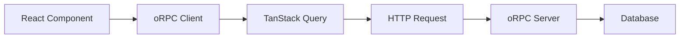

## Overview

Start UI [web] uses [oRPC](https://orpc.unnoq.com/) for type-safe, end-to-end typed API calls, integrated with [TanStack Query](https://tanstack.com/query) for data fetching, caching, and state management.

## Architecture



## oRPC Server Setup

The server router is defined in `src/server/router.ts`:

```typescript src/server/router.ts
import { InferRouterInputs, InferRouterOutputs } from '@orpc/server';
import accountRouter from './routers/account';
import bookRouter from './routers/book';
import genreRouter from './routers/genre';
import userRouter from './routers/user';
import configRouter from './routers/config';

export type Router = typeof router;
export type Inputs = InferRouterInputs<typeof router>;
export type Outputs = InferRouterOutputs<typeof router>;

export const router = {
  account: accountRouter,
  book: bookRouter,
  genre: genreRouter,
  user: userRouter,
  config: configRouter,
};
```

### Example Router Definition

Here's a simplified example from the book router:

```typescript src/server/routers/book.ts
import { orpc } from '../orpc';
import { z } from 'zod';

const bookSchema = z.object({
  id: z.string(),
  title: z.string(),
  author: z.string(),
  genreId: z.string(),
});

export default {
  list: orpc
    .input(
      z.object({
        page: z.number().int().positive().default(1),
        perPage: z.number().int().positive().default(10),
        searchTerm: z.string().optional(),
      })
    )
    .query(async ({ input, context }) => {
      const books = await context.db.book.findMany({
        where: input.searchTerm ? {
          OR: [
            { title: { contains: input.searchTerm, mode: 'insensitive' } },
            { author: { contains: input.searchTerm, mode: 'insensitive' } },
          ],
        } : undefined,
        skip: (input.page - 1) * input.perPage,
        take: input.perPage,
      });
      
      return { items: books };
    }),
    
  create: orpc
    .input(bookSchema.omit({ id: true }))
    .mutation(async ({ input, context }) => {
      return await context.db.book.create({ data: input });
    }),
};
```

## oRPC Client

The client is configured in `src/lib/orpc/client.ts`:

```typescript src/lib/orpc/client.ts
import { createORPCClient } from '@orpc/client';
import { Router } from '@/server/router';

export const orpcClient = createORPCClient<Router>({
  baseURL: '/api/rpc',
  fetch: (input, init) => {
    return fetch(input, {
      ...init,
      credentials: 'include', // Send cookies
    });
  },
});
```

## Fetching Data with TanStack Query

### Basic Query

```typescript
import { useQuery } from '@tanstack/react-query';
import { orpcClient } from '@/lib/orpc/client';

function BookList() {
  const { data, isLoading, error } = useQuery({
    queryKey: ['books'],
    queryFn: () => orpcClient.book.list({ page: 1, perPage: 10 }),
  });

  if (isLoading) return <div>Loading...</div>;
  if (error) return <div>Error: {error.message}</div>;

  return (
    <ul>
      {data?.items.map((book) => (
        <li key={book.id}>{book.title}</li>
      ))}
    </ul>
  );
}
```

### Query with Parameters

```typescript
function BookDetail({ id }: { id: string }) {
  const { data: book } = useQuery({
    queryKey: ['book', id],
    queryFn: () => orpcClient.book.get({ id }),
    enabled: !!id, // Only fetch when id exists
  });

  return <div>{book?.title}</div>;
}
```

### Search Query

```typescript
function SearchableBookList() {
  const [searchTerm, setSearchTerm] = useState('');
  const [debouncedSearch] = useDebounce(searchTerm, 300);

  const { data } = useQuery({
    queryKey: ['books', debouncedSearch],
    queryFn: () => orpcClient.book.list({ 
      searchTerm: debouncedSearch,
      page: 1,
      perPage: 20,
    }),
  });

  return (
    <div>
      <input 
        value={searchTerm} 
        onChange={(e) => setSearchTerm(e.target.value)}
        placeholder="Search books..."
      />
      {data?.items.map((book) => <div key={book.id}>{book.title}</div>)}
    </div>
  );
}
```

## Mutations

### Basic Mutation

```typescript
import { useMutation, useQueryClient } from '@tanstack/react-query';
import { orpcClient } from '@/lib/orpc/client';

function CreateBookForm() {
  const queryClient = useQueryClient();
  
  const createBook = useMutation({
    mutationFn: (data: { title: string; author: string; genreId: string }) => 
      orpcClient.book.create(data),
    onSuccess: () => {
      // Invalidate and refetch books list
      queryClient.invalidateQueries({ queryKey: ['books'] });
    },
  });

  const handleSubmit = (e: FormEvent) => {
    e.preventDefault();
    createBook.mutate({
      title: 'New Book',
      author: 'John Doe',
      genreId: 'genre-id',
    });
  };

  return (
    <form onSubmit={handleSubmit}>
      <button type="submit" disabled={createBook.isPending}>
        {createBook.isPending ? 'Creating...' : 'Create Book'}
      </button>
      {createBook.isError && (
        <div>Error: {createBook.error.message}</div>
      )}
    </form>
  );
}
```

### Optimistic Updates

```typescript
const updateBook = useMutation({
  mutationFn: (data: { id: string; title: string }) => 
    orpcClient.book.update(data),
  onMutate: async (variables) => {
    // Cancel outgoing refetches
    await queryClient.cancelQueries({ queryKey: ['book', variables.id] });
    
    // Snapshot previous value
    const previousBook = queryClient.getQueryData(['book', variables.id]);
    
    // Optimistically update
    queryClient.setQueryData(['book', variables.id], (old: any) => ({
      ...old,
      title: variables.title,
    }));
    
    return { previousBook };
  },
  onError: (err, variables, context) => {
    // Rollback on error
    if (context?.previousBook) {
      queryClient.setQueryData(['book', variables.id], context.previousBook);
    }
  },
  onSettled: (data, error, variables) => {
    // Refetch after error or success
    queryClient.invalidateQueries({ queryKey: ['book', variables.id] });
  },
});
```

## Server-Side Data Fetching

Fetch data on the server in route loaders:

```typescript src/routes/manager/books/$id.tsx
import { createFileRoute } from '@tanstack/react-router';
import { orpcClient } from '@/lib/orpc/client';

export const Route = createFileRoute('/manager/books/$id')({
  loader: async ({ params, context }) => {
    const book = await context.queryClient.ensureQueryData({
      queryKey: ['book', params.id],
      queryFn: () => orpcClient.book.get({ id: params.id }),
    });
    return { book };
  },
  component: BookPage,
});

function BookPage() {
  const { book } = Route.useLoaderData();
  // Data is already available from SSR
  return <div>{book.title}</div>;
}
```

## Pagination

### Offset-Based Pagination

```typescript
function PaginatedBooks() {
  const [page, setPage] = useState(1);
  const perPage = 10;

  const { data, isLoading, isPlaceholderData } = useQuery({
    queryKey: ['books', page],
    queryFn: () => orpcClient.book.list({ page, perPage }),
    placeholderData: (prev) => prev, // Keep previous data while fetching
  });

  return (
    <div>
      {data?.items.map((book) => <BookCard key={book.id} book={book} />)}
      
      <div>
        <button
          onClick={() => setPage((p) => Math.max(1, p - 1))}
          disabled={page === 1}
        >
          Previous
        </button>
        <span>Page {page}</span>
        <button
          onClick={() => setPage((p) => p + 1)}
          disabled={isPlaceholderData || !data?.items.length}
        >
          Next
        </button>
      </div>
    </div>
  );
}
```

### Infinite Scroll

```typescript
import { useInfiniteQuery } from '@tanstack/react-query';

function InfiniteBookList() {
  const {
    data,
    fetchNextPage,
    hasNextPage,
    isFetchingNextPage,
  } = useInfiniteQuery({
    queryKey: ['books', 'infinite'],
    queryFn: ({ pageParam = 1 }) => 
      orpcClient.book.list({ page: pageParam, perPage: 20 }),
    getNextPageParam: (lastPage, allPages) => {
      return lastPage.items.length === 20 ? allPages.length + 1 : undefined;
    },
    initialPageParam: 1,
  });

  return (
    <div>
      {data?.pages.map((page) => (
        page.items.map((book) => <BookCard key={book.id} book={book} />)
      ))}
      
      {hasNextPage && (
        <button onClick={() => fetchNextPage()} disabled={isFetchingNextPage}>
          {isFetchingNextPage ? 'Loading...' : 'Load More'}
        </button>
      )}
    </div>
  );
}
```

## Error Handling

```typescript
function BookListWithErrors() {
  const { data, error, isError } = useQuery({
    queryKey: ['books'],
    queryFn: () => orpcClient.book.list({}),
    retry: 3,
    retryDelay: (attemptIndex) => Math.min(1000 * 2 ** attemptIndex, 30000),
  });

  if (isError) {
    return (
      <div>
        <h2>Error loading books</h2>
        <p>{error.message}</p>
      </div>
    );
  }

  return <div>{/* ... */}</div>;
}
```

## Best Practices

<CardGroup cols={2}>
  <Card title="Use Query Keys" icon="key">
    Structure query keys hierarchically: `['books', id]` for easy invalidation
  </Card>
  <Card title="Invalidate Smart" icon="arrows-rotate">
    After mutations, invalidate related queries to keep UI fresh
  </Card>
  <Card title="Handle Loading" icon="spinner">
    Always handle loading and error states for better UX
  </Card>
  <Card title="Leverage SSR" icon="server">
    Use route loaders to fetch data on the server for faster initial loads
  </Card>
</CardGroup>

## Related Documentation

<CardGroup cols={2}>
  <Card title="API Reference" icon="code" href="/api/overview">
    Complete API endpoint documentation
  </Card>
  <Card title="State Management" icon="database" href="/core-concepts/state-management">
    Learn about managing state with TanStack Query and Zustand
  </Card>
</CardGroup>
